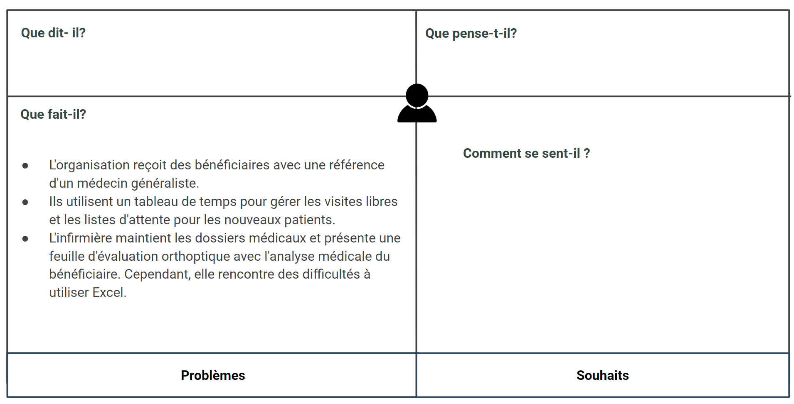

# Empathie

## Introduction 

## Service Social - Khawla souan 

## Médecin général Algamot asia

## D’empathie d’orthoptiste - Imane Errahmouni

## Psychomotricien - Salma LIKRAM

## Assistant dentaire spécialiste Interne - Tallaoui sanae

## Service de rééducation - Kinésithérapeute - Nassima El Ouazzani

## Service de rééducation - Ergothérapeute - Alaoui Ghita

## Service de rééducation - Psychologue - Anas Mjadli

## Service rééducation - orthophoniste - SAMIA KABBAJ 

## Références 
[Carte d'empathie](https://docs.google.com/presentation/d/1WkibTkxVvAtEwSUtbnktpjZTRztYOJby6Cckc1bsjlg/edit)

## Conclusion

<!-- Image -->
