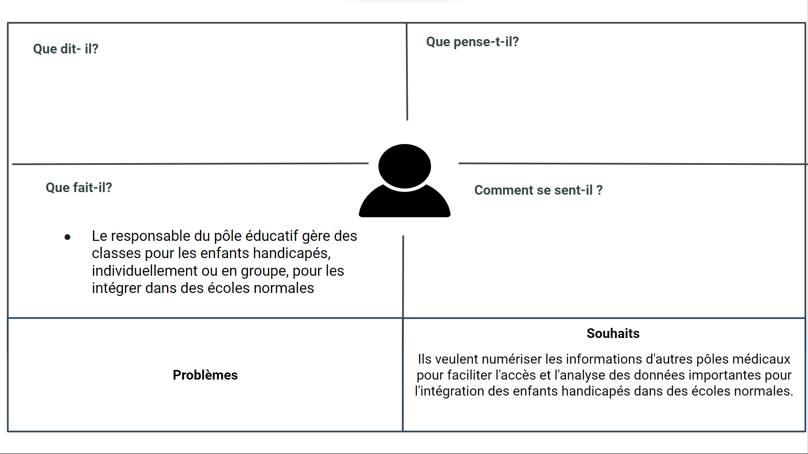
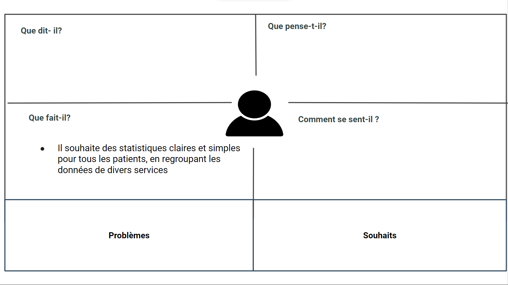

# Empathie

## Introduction 

## 1. Service Social - Khawla souan 

## 2. Médecin général Algamot asia

## 3. D’empathie d’orthoptiste - Imane Errahmouni

## 4. Psychomotricien - Salma LIKRAM

## 5. Assistant dentaire spécialiste Interne - Tallaoui sanae

## 6. Service de rééducation - Kinésithérapeute - Nassima El Ouazzani

## 7. Service de rééducation - Ergothérapeute - Alaoui Ghita

## 8. Service de rééducation - Psychologue - Anas Mjadli

## 9. Service rééducation - orthophoniste - SAMIA KABBAJ 

## 10. pole sport - (Yassine serhane, Karima bamoussa)

## 11. Responsable de pôle éducatif - Fouad Ichir

## 12. Directrice 

## Références 
[Carte d'empathie](https://docs.google.com/presentation/d/1WkibTkxVvAtEwSUtbnktpjZTRztYOJby6Cckc1bsjlg/edit)

## Conclusion

