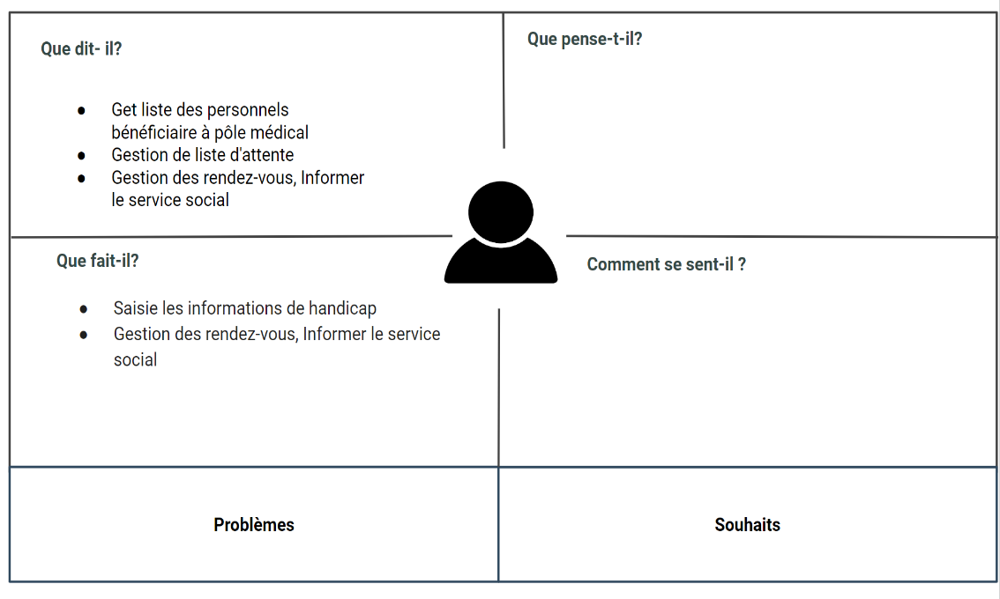

# Empathie  avec l'orthophoniste
{:class="sectionHeader"}

<!-- new slide -->

## Carte d'empathie

{:width='80%' }
*Figure: Empathie d'othophoniste*

<!-- note -->

Une séance d’empathie a été réalisée avec SAMIA KABBAJ, l’orthophoniste de service de rééducation, le 23 avril 2023.

## Entretien

### Ce qu'il dit 

- j'ai la liste des personnels bénéficiaire du pôle médical
- Gestion de liste d'attente 
- Gestion des rendez-vous
- Informer le service social
  

### Ce qu’il fait 

Saisie les informations de handicap
- Date
- N° du dossier
- Nom et Prénom
- Sexe
- Age
- Diagnostic
- Présence
- Nombre de séance->S1
