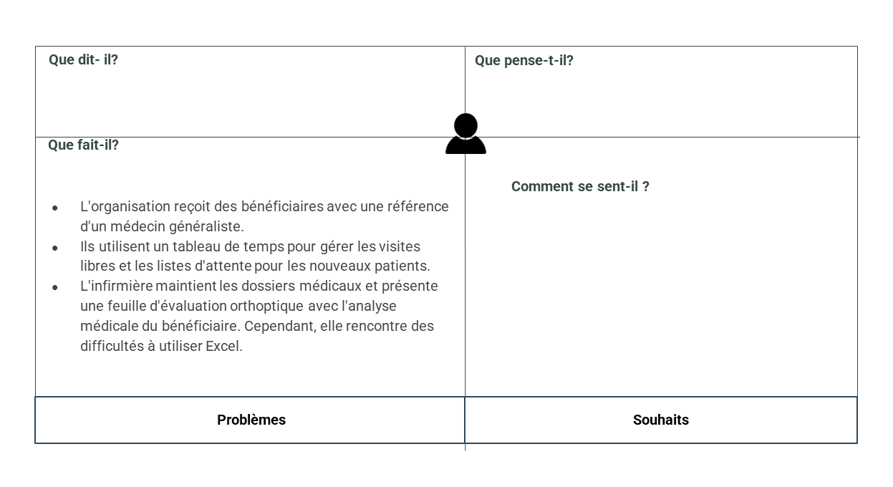

# Empathie avec service de rééducation (Orthoptiste)
{:class="sectionHeader"}
## carte d'empathie Orthoptiste 
*carte d'empathie Orthoptiste*
un séance d'empathie avec madame Imane Errahmouni 

<!-- note -->
## Persona : 
Imane Errahmouni

## Ce qu'il dit : 
- nous recevons les bénéficiaires accompagnés de leur bon d’orientation suivi par le médecin généraliste.
- à l'aide d'un tableau de temps composé de deux parties :
- une pour les bénéficiaires en visite libre sans rendez-vous.
- la seconde pour que les nouveaux soient mis sur la liste d'attente et appelés par le service social.
- le dossier médical est gardé par l'infirmière pour consigner les données,
- nous présentons une feuille dite <<BILAN ORTHOPTIQUE>>  décrivons les données et l'analyse médicale du bénéficiaire.
- au début elle gère ce tableau sur papier  puis elle a switché vers l'outil Excel, or elle trouve des difficultés à travailler avec ce dernier

## Ce qu’il fait : 
- Numéro d’ordre 
- Date
- Numéro dossier 
- ACTES RELISES
- BILAN ORTHOPTIQUE
- NV CAS
- ANC CAS
- TRAITEMENT D’AMBLYOPIE
- REEDUCATION ORTHOPTIQUE
- CHAMP VISUEL
- AUTRES
- ACTES NON REALISES
- ABSENCE
- NON COOPERANT 
- AUTRE
- OBSERVATION
- RH

<!-- new slide -->