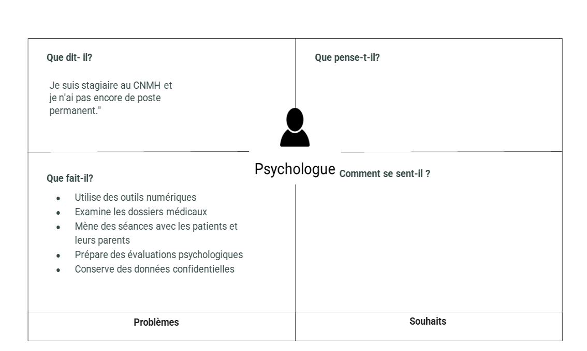

# Empathie avec service de rééducation (psychologue)
{:class="sectionHeader"}

<!-- new slide -->
## Introduction
{: width="700px" }*figure : Carte d'empathie du psychologue Anas Mjadli*

<!-- note -->

Une séance d’empathie a été réalisée avec psychologue Anas Mjadli pour comprendre ses besoins et ses attentes par rapport à son travail au sein du centre CNMH.

## Livrables

### lien de Rapport
- [ Rapport](/besoin/empathie-psychologue/rapport.html)

### lien de Présentation
- [ Présentation ](/besoin/empathie-psychologue/presentation.html)

<!-- new slide -->
