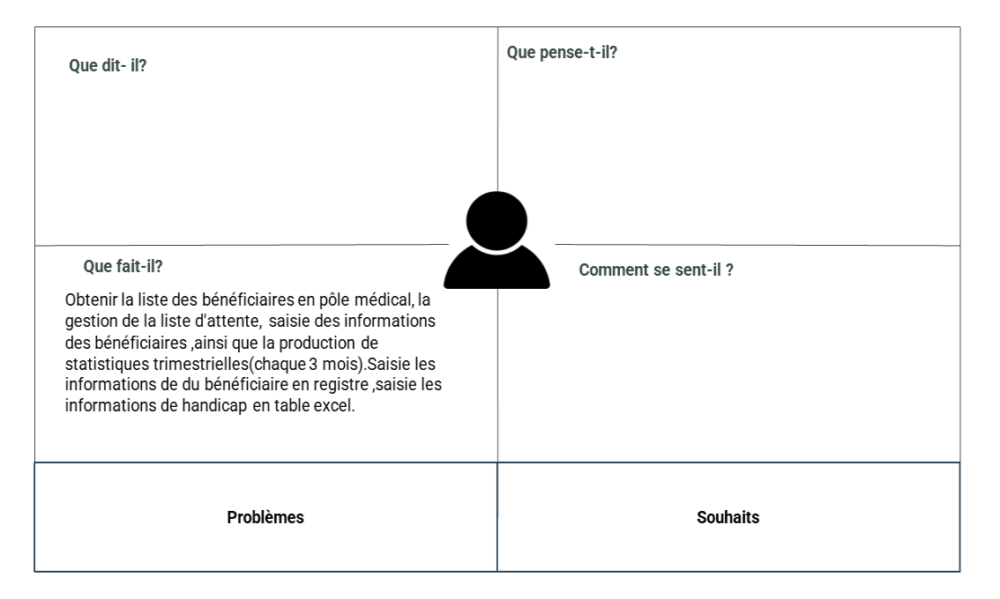

# Empathie psychomotricie

<!-- new slide -->

## Cart de empathie

{:width="500px" }_Figure: Introduction_

<!-- note -->

Une séance d’empathie a été réalisée avec SALMA LIKRAM, psychomotrice de service de rééducation, le 23 avril 2023.

## Lien de Présentation

[Présentation d'empathie de psychomotricie](./empathie-psychomotricien/presentation.html)

## Lien de Rapport

[Rapport d'empathie de psychomotricie](./empathie-psychomotricien/rapport.html)
