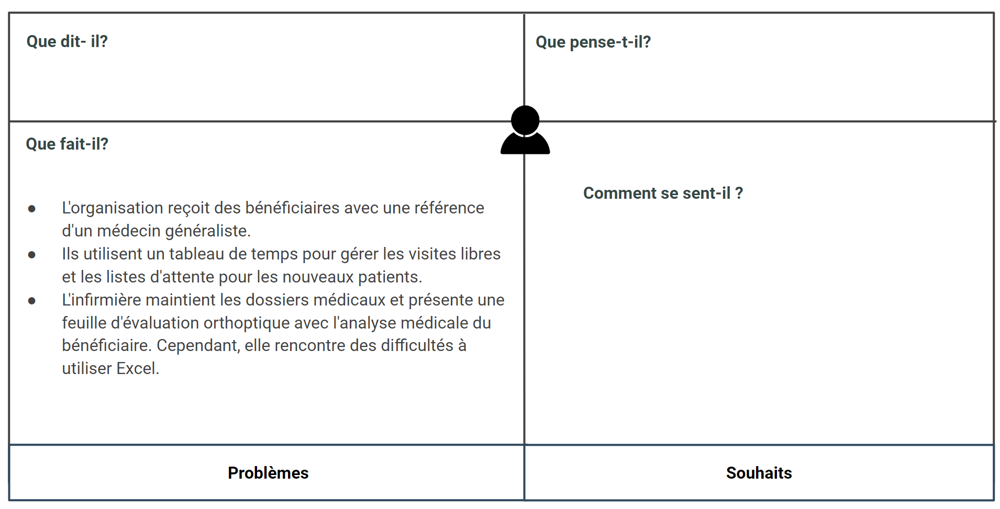

# Pole-médical

## Pole-médical - infirmière de médecine général 

## Pole-médical - service de rééducation (Orthoptiste) 

## Pole-médical - service de rééducation (psychomotricien) 

## Pole-médical - assistant dentaire médecin spécialiste Interne 

## Pole-médical - service de rééducation (Kinésithérapeute)

## Pole-médical - service de rééducation (Ergothérapeute)

## Pole-médical - service de rééducation (psychologue)

## Pole-médical - service de rééducation (orthophoniste)

